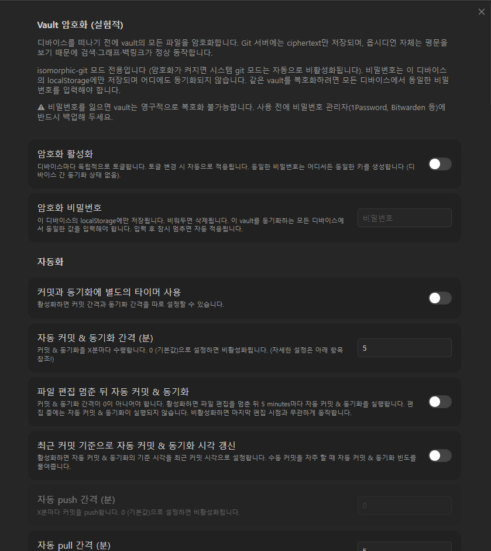
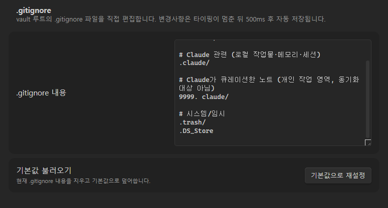

# obsidian-git-encrypt-kr

[Vinzent03/obsidian-git](https://github.com/Vinzent03/obsidian-git)의 **포크(fork)** 입니다.
원작자 [@Vinzent03](https://github.com/Vinzent03), [@denolehov](https://github.com/denolehov),
그리고 [upstream Contributors](https://github.com/Vinzent03/obsidian-git/graphs/contributors)
모든 분들의 작업에 깊이 감사드립니다 — 본 fork는 그 위에 한국어 UI와
**투명한 vault 암호화 레이어**만 얇게 얹은 버전입니다.

플러그인 본체의 기능 설명(Source Control View, 자동 동기화, History View, Diff View 등)은
[원본 저장소의 README](https://github.com/Vinzent03/obsidian-git#readme)를 참조하세요.

---

## ✨ 본 fork가 추가한 것

### 1. Vault 투명 암호화 (AES-256-GCM)

- 비밀번호로 도출한 키(PBKDF2, 200,000 iterations)로 vault 파일을
  암호화한 뒤 git 원격으로 push합니다.
- 원격 저장소(GitHub/GitLab 등)에는 **ciphertext만** 올라가며, 비밀번호를
  모르는 사람(호스팅 제공자 포함)은 파일 내용을 읽을 수 없습니다.
- 옵시디언 자체는 평문을 읽기 때문에 검색·그래프·백링크는 정상 동작합니다.
- `isomorphic-git` 모드 전용입니다 — 암호화를 켜면 시스템 git 모드는 자동으로
  비활성화됩니다.

### 2. 한국어 UI

설정 화면, 상태 바, 명령 팔레트, 모달 메시지를 한국어로 번역했습니다.

---

## ⚠️ 비밀번호 보관 — 반드시 읽어주세요

비밀번호는 **이 디바이스의 `localStorage`에만 저장됩니다.**

- 서버, git 원격, 옵시디언 Sync 등 다른 어디와도 동기화되지 않습니다.
- 같은 vault를 여러 디바이스에서 쓰려면 **모든 디바이스에서 동일한 비밀번호**를
  직접 입력해야 합니다 (한 번 입력하면 그 디바이스에는 계속 남아있습니다).

### 🚨 비밀번호를 잃으면 vault는 영구적으로 복호화 불가능합니다.

- 본 fork의 암호화는 산업 표준(AES-256-GCM + PBKDF2)을 따르므로, 비밀번호
  없이 ciphertext만으로 평문을 복구할 방법은 **수학적으로 존재하지 않습니다**.
- **사용 전에 반드시 비밀번호 관리자(1Password, Bitwarden, KeePass 등)에
  백업해 두세요.** 종이/메모 앱은 사고로 잃기 쉬우니 권장하지 않습니다.
- 디바이스 분실·초기화·새 PC 셋업 후 비밀번호 백업이 없으면 vault의 모든
  ciphertext를 다시 평문으로 되돌릴 수 없습니다.
- 원본 평문 vault가 어딘가에 따로 남아 있는 한, 새 비밀번호로 re-encrypt해
  복구할 수는 있습니다. 평문 사본조차 없으면 데이터는 사실상 소실됩니다.

---

## 설치

### BRAT 사용 (권장)

1. 옵시디언 → Settings → Community plugins → Browse → "BRAT" 검색 → Install → Enable
2. Command palette(`Ctrl+P`) → **"BRAT: Add a beta plugin for testing"**
3. 입력란에 `o2o-kkami/obsidian-git-encrypt-kr` 입력 → Add
4. Community plugins 목록에서 **"Git (암호화)"** 활성화

### 수동 설치

[Releases](https://github.com/o2o-kkami/obsidian-git-encrypt-kr/releases) 페이지에서
최신 release의 `main.js`, `manifest.json`, `styles.css`를 받아 vault의
`.obsidian/plugins/obsidian-git-encrypt-kr/` 폴더(없으면 생성)에 복사한 뒤
옵시디언을 재시작하고 Community plugins에서 활성화하세요.

---

## 설정 가이드

설정 화면의 **최상단** 두 섹션이 본 fork 고유 설정입니다.

### 1. Vault 암호화 설정

순서대로 따라가시면 됩니다:

1. **암호화 활성화** 토글로 켭니다.
   - 디바이스마다 독립적으로 토글됩니다 (디바이스 간 동기화되지 않음).
   - 동일한 비밀번호는 어디서든 동일한 키를 생성하므로, 같은 비밀번호를 쓰는
     모든 디바이스는 같은 vault에 접근할 수 있습니다.
2. **암호화 비밀번호** 입력란에 비밀번호를 입력합니다.
   - 입력 후 잠시 멈추면 자동 적용됩니다.
   - 비밀번호 변경은 키 재도출(PBKDF2 200k iter)을 트리거하며 디바운싱됩니다.
3. **반드시 비밀번호 관리자에 백업**해 두세요. 위 ⚠️ 경고를 다시 한 번 확인하세요.

### 2. `.gitignore` 편집

암호화 설정 바로 아래에 vault 루트의 `.gitignore`를 직접 편집할 수 있는
인라인 에디터가 위치합니다.

- 변경사항은 타이핑 멈춘 뒤 500ms 후 자동 저장됩니다.
- **기본값으로 재설정** 버튼을 누르면 안전한 기본값(`.obsidian/workspace*`,
  `.trash/`, `.DS_Store`, 캐시 파일 등 제외)으로 덮어씁니다.
- 본 fork는 plugin 최초 설치 시점에 사용자가 암호화·ignore-list를 한 곳에서
  같이 검토할 수 있도록 의도적으로 두 섹션을 인접 배치했습니다.

> 💡 암호화는 ignore-list에 포함되지 않은 파일만 적용됩니다. 동기화하고
> 싶지 않은 파일(예: `.obsidian/workspace*`, 대용량 임시 캐시)은 `.gitignore`에
> 추가하세요.

---

## 라이선스 / 출처

- **라이선스**: MIT — upstream과 동일하며 `LICENSE` 파일을 그대로 유지합니다.
- **원작자**: [@Vinzent03](https://github.com/Vinzent03), [@denolehov](https://github.com/denolehov)
  외 [모든 upstream 기여자](https://github.com/Vinzent03/obsidian-git/graphs/contributors).
- **후원**: 플러그인 본체 개발에 감사 표시를 하시려면
  [원작자의 Ko-fi](https://ko-fi.com/F1F195IQ5)로 부탁드립니다.
  본 fork는 별도 후원 채널을 두지 않습니다.

이슈 라우팅:
- 본 fork 한정(암호화 layer, 한국어 UI, BRAT 설치 등): [본 저장소 Issues](https://github.com/o2o-kkami/obsidian-git-encrypt-kr/issues)
- plugin 본체 기능: [원본 저장소 Issues](https://github.com/Vinzent03/obsidian-git/issues)
